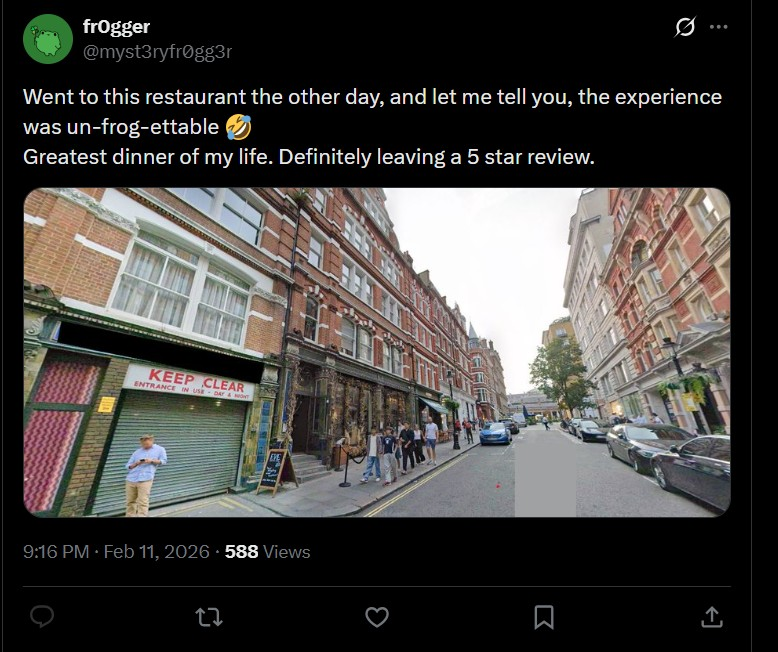
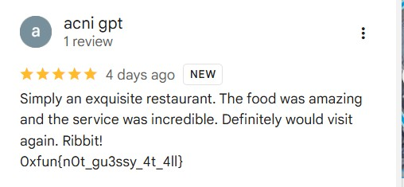

# Frog Finder 2 - Writeup

| Field | Value |
|-------|--------|
| **CTF** | 0xfun CTF 2026 |
| **Category** | OSINT |

---

## Challenge Overview

>A frog has escaped from prison cells of a cybersecurity club and is on the run.
>
>Somehow, they've gained the ability to roam the internet and gain human intellect?
>
>His newest adventures are documented online, you need to track them down. I'm not too sure what platform they've run off to, but I'm sure the handle would be somewhat along the lines of `@myst3ryfr0gg3r`.
>
>You will find the flag already in the format 0xfun{...}

So the task is clearly an **identity-tracking OSINT challenge**  follow the online traces of this account until the flag is found.

---

## Step 1 - Username Enumeration

First I searched for the username across platforms using the tool:`whatsmyname.me`

It returned multiple results, but the `x.com/myst3ryfr0gg3r`  profile looked the most relevant.

---

## Step 2 - Investigating the X Account

Visiting the profile revealed 3 posts:

Two posts were normal/joke posts.

One post was important:


> *Went to this restaurant the other day, and let me tell you, the experience was un-frog-ettable 🤣
> Greatest dinner of my life. Definitely leaving a 5 star review.*



The tweet also contained an image of a street and a building.

This tells us:

**We must locate the restaurant and find the review he left.**

So now the challenge becomes **Geo-OSINT**.

---

## Step 3 - Reverse Image Search

I reverse searched the image using **Yandex Image Search**.

The exact same image was found on Wikimedia:

`https://commons.wikimedia.org/wiki/File:36-38_Southampton_Street_London.jpg`

The page contained coordinates:

```
51° 30′ 39.11″ N, 0° 07′ 19.14″ W
```

---

## Step 4 - Locate the Restaurant

I pasted the coordinates into Google Maps.

The location corresponds to:

```
Frog by Adam Handling Restaurant
Covent Garden, London
```

The frog theme perfectly matches the username  confirming this is the correct pivot.

---

## Step 5 - Finding the Review

Since the tweet mentioned:

> leaving a 5 star review

I checked the **Google Maps reviews** for the restaurant.

After scrolling through the reviewers, I eventually found a review left by the frog account containing the flag:



---

## Flag

```
0xfun{n0t_gu3ssy_4t_4ll}
```

---

## Key Learning

This challenge demonstrates a classic OSINT chain:

1. Username enumeration
2. Social media pivot
3. Geo-location via reverse image search
4. Coordinates extraction
5. Real-world place identification
6. Review platform pivot
7. Flag discovery

Not guessing  just structured tracking.