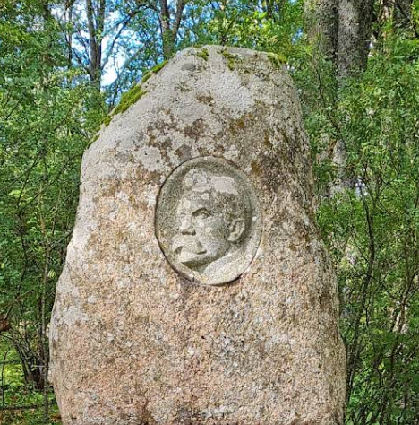
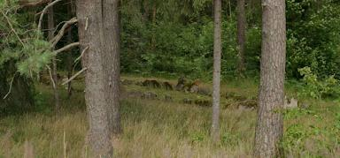

# Temptation Stone Silence - OSINT 

| Field | Value |
|-------|--------|
| **CTF** | 0xfun CTF 2026 |
| **Category** | OSINT |

## Challenge Overview

> Three images. Three fragments. Each one points to a place, and each one carries a different kind of weight.
>
> Temptation shows up first. Something made to catch the eye and test what people choose to value. Stone comes next. A name important enough to be carved and left behind when everything else moves on. Silence comes last. The silence of a legend. They say the region’s elder once made a deal with the devil, and the land has been quiet about it ever since.
>
> Find the Latvian place name (pilsēta/ciems) for each image and submit the flag:
>
> 0xfun{City1_City2_City3}
>
>Names only. Latvian spelling and diacritics required.

#### Another great OSINT chall which required a very focused way to solve 

Instead of guessing locations randomly, I approached the challenge methodically:

1. Extract visual signals from each image
2. Convert symbolism → searchable attributes
3. Pivot language (English → Latvian/Russian when needed)
4. Correlate folklore, geography, and cultural references
5. Validate using primary sources

---

# Image 1 - Temptation

### Visual Clue
A **large golden pig statue** placed outdoors in a landscaped area.

### Interpretation
A piggy bank symbolises:
- wealth
- greed
- prosperity
- temptation

The hint says:

> *“Something made to catch the eye and test what people choose to value.”*

So instead of searching the full riddle, I searched using object-based OSINT.

### Search Pivot
I Reverse Search the image on `yandex.com` from there i found some visual clues and then i found one blog `https://renatar.livejournal.com/480085.html` which had the exact same image and description about the image  

This led to references of a **foam plastic golden pig statue in Mālpils**.

### Result
**City1 = Mālpils**

---

# Image 2 - Stone

### Visual Clue
A carved stone monument containing a portrait of a man.

### Interpretation

Yes you guessed it Right again i Reverse search the Image in `yandex.com` and got juicy results
`The hint:`

> *“A name important enough to be carved and left behind when everything else moves on.”*

This suggests a memorial to a historically important cultural figure.

### Search Pivot
Latvian writer stone monument forest

One strong recurring result:
**Rūdolfs Blaumanis** a major Latvian literary figure.

I compared the portrait carving and confirmed it matched the monument.

Then I verified the burial/memorial location using this blog.
`https://commons.wikimedia.org/wiki/File:%C4%92rg%C4%BCi,_R._Blauma%C5%86a_kapa_piemineklis_2000-05-27_-_panoramio.jpg`

### Location Verification
Blaumanis memorial and grave are located in **Ērgļi**.

### Result
**City2 = Ērgļi**

---

# Image 3 - Silence of a Legend

- At first i thought it were a group of European bison (Bison bonasus) in a wooded habitat.
-  Wasted time on it and got no results :(( so i changed the approach.
### Visual Clue
A quiet forested area containing arranged stones.

### Interpretation
Hint:

> *“They say the region’s elder once made a deal with the devil…”*

This indicates:
- folklore
- pagan or ancient site
- rural Latvian location
- archaeological structure

### OSINT Approach
Instead of sentence searching, I used keyword clustering:

- Velna Latvija
- Latvian devil folklore site
- Velna laiva
- Latvia legend elder deal with devil

This produced multiple folklore sites across Latvia.

---

### Image Matching
Comparing environmental features:
- natural forest
- arranged stones
- archaeological appearance

One location matched both folklore AND structure:

**Bīlavu Velna laiva (Devil’s Boat of Bīlava)**

This site:
- ancient Scandinavian burial structure
- surrounded by devil folklore
- visually identical to the image

### Location Verification
Located in **Lūbes pagasts, Talsi municipality**

### Result
**City3 = Lube**

## Flag
`0xfun{Mālpils_Ērgļi_Lube}`

---
## Key Takeaways
- Symbols → keywords → locations
- Don’t search riddles, search objects
- Local language searches reveal hidden results
- Environment details eliminate wrong guesses fast
- Always verify with maps or primary sources