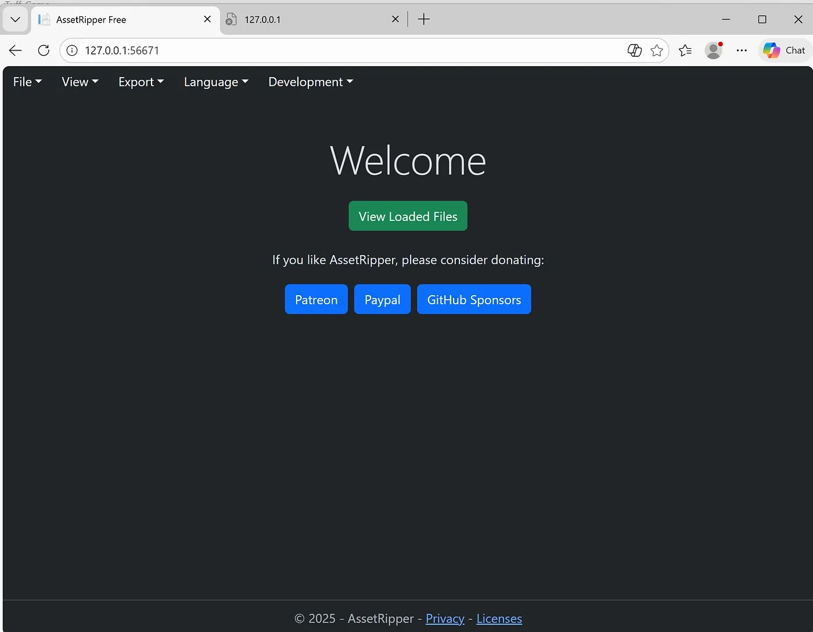
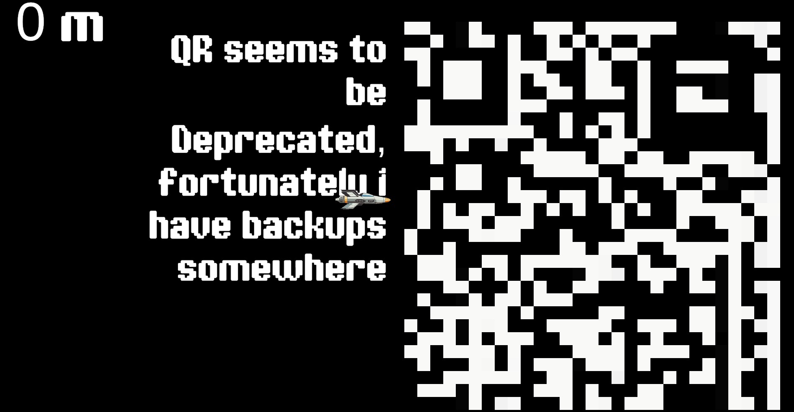

# Tuff-Game - Writeup

| Field | Value |
|-------|--------|
| **CTF** | BITSCTF |
| **Category** | Reverse Engineering |

##  Challenge Description
> My friend Kekwman has challenged me to defeat this game, reach a million metres and help me defeat his score.

The goal of the challenge was to reach **1,000,000 meters Horizontally** inside the game.

---

##  Initial Attempt – Cheat Engine

At first, I attempted to modify the game using **Cheat Engine** by searching for:

- Current width value  I managed to reach **1,000,000 meters Horizontally** then output which printed a **flag part 1 PNG file**.


However, this was only **partial information**, and not the complete flag.

This indicated that something deeper was hidden inside the game.

---


## Step 1 – Extract Files

Using **AssetRipper**, I extracted the full Unity project files.



After extraction, I began manually searching for anything related to the flag.

While browsing through the exported folders, I discovered a file inside:


The exact file path was:
`Tuff_Game\Tuff_Game\xport\AssetRipper_export_20260223_134806\Assets\Texture2D\Fl4g_second_Half.png`


This image contained **Flag Part 2**.

However, it also included an additional hint telling me to:

> “Think vertically”

This hint was important and indicated that simply reconstructing something normally might not be enough  the solution likely required vertical alignment or vertical progression inside the game.

After seeing this hint, I returned to the decompiled code in dnSpy to further analyze how vertical movement was handled.

##  Step 2 – Modify the Game Using dnSpy

Unity stores compiled scripts inside:
`Tuff_Game_Data/Managed/Assembly-CSharp.dll`

We use **dnSpy** to modify the compiled code.

---

##  Remove Player Movement Boundaries

Original `ClampToCamera()` function:

```csharp
private void ClampToCamera()
{
    Vector3 vector = this.cam.ViewportToWorldPoint(new Vector3(0f, 0f, 0f));
    Vector3 vector2 = this.cam.ViewportToWorldPoint(new Vector3(1f, 1f, 0f));
    float min = vector.x + this.padding;
    float max = vector2.x - this.padding;
    float min2 = vector.y + this.padding;
    float max2 = vector2.y - this.padding;
    float x = Mathf.Clamp(base.transform.position.x, min, max);
    float y = Mathf.Clamp(base.transform.position.y, min2, max2);
    base.transform.position = new Vector3(x, y, 0f);
}
```
#### Fix
```csharp
Remove the clamp entirely:
private void ClampToCamera()
{
}
```

Spawn Player at Y = 1,000,000

Modify the `Start()` method inside ShipMovement:
```csharp
private void Start()
{
    this.cam = Camera.main;

    Vector3 pos = base.transform.position;
    pos.y = 1000000f;
    base.transform.position = pos;
}
```
Now the player spawns at 1,000,000 meters vertically.

## Remove Camera Vertical Clamp

Original camera code:
`float y = Mathf.Clamp(this.target.position.y, this.minY, this.maxY);`

Fix

Replace with:`float y = this.target.position.y;`

Final `LateUpdate():`

```csharp
private void LateUpdate()
{
    if (this.target == null)
        return;

    float x = this.target.position.x + this.xOffset;
    float y = this.target.position.y;

    Vector3 targetPos = new Vector3(x, y, this.fixedZ);

    base.transform.position = Vector3.Lerp(
        base.transform.position,
        targetPos,
        this.smoothSpeed * Time.deltaTime
    );
}
```

### Result

After these modifications:

- Player spawns at Y = 1,000,000
- Camera follows correctly
- A distorted QR appears



The QR displayed on screen readable. Along with it, a message appears:

> **Fortunately, I have backups somewhere**

This line is very important.

It suggests that the QR currently shown in the game is not the original one, and that a backup version must exist inside the game files.

Revisiting the extracted project from AssetRipper, I navigated to:`Tuff_Game\xport\AssetRipper_export_20260223_134806\Assets\Resources`


### Understanding the Naming Pattern

Format:

`rq_<row>_<column>.png`

Each image tile follows a structured grid-based naming system.

Example:

- `rq_0_0.png` → Row 0, Column 0  
- `rq_0_1.png` → Row 0, Column 1  
- `rq_5_12.png` → Row 5, Column 12  
- `rq_29_29.png` → Row 29, Column 29  

From inspection of the extracted files, the numbering starts from **0** and goes up to **29** for both rows and columns.

This means:

- Rows range from `0 → 29`
- Columns range from `0 → 29`

So the full grid size is:`30 rows × 30 columns`

Total number of tiles:`30 × 30 = 900 tiles`


Each small PNG represents one tile of the full QR image.

To reconstruct the QR correctly:

1. Sort tiles by **row number** (0 to 29).
2. Within each row, sort by **column number** (0 to 29).
3. Place tiles left-to-right.
4. Stack rows top-to-bottom.

When assembled in this exact order, the full QR code is reconstructed successfully.

## Step 3 – Reconstruct the QR Using Python

Place the following script in the same directory as the rq PNG files.

### Python Reconstruction Script
```
from PIL import Image
import os

GRID_SIZE = 30

sample = Image.open("rq_0_0.png")
tile_w, tile_h = sample.size

qr_img = Image.new("RGB", (tile_w * GRID_SIZE, tile_h * GRID_SIZE))

for y in range(GRID_SIZE):
    for x in range(GRID_SIZE):
        tile = Image.open(f"rq_{y}_{x}.png")
        qr_img.paste(tile, (x * tile_w, y * tile_h))

qr_img.save("reconstructed_qr.png")
```


## Final Summary

| Step | Action                                 |
| ---- | -------------------------------------- |
| 1    | Modify Assembly-CSharp.dll using dnSpy |
| 2    | Remove player clamp                    |
| 3    | Spawn player at Y = 1,000,000          |
| 4    | Remove camera vertical clamp           |
| 5    | Extract assets using AssetRipper       |
| 6    | Locate rq_<row>_<col>.png tiles        |
| 7    | Reconstruct QR using Python            |
| 8    | Scan QR → Get Flag                     |

## Flag
`BITSCTF{Th1$_14_D3f1n1t3ly_Th3_fl4g}`

PWN by **W4RR1OR**